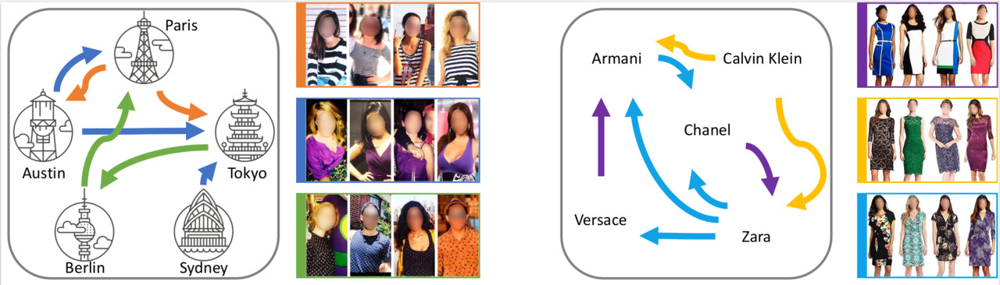

# Modeling Fashion Influence from Photos

Implementation for our work to model fashion influence relations among fashion brands or major cities around the world learned from photos.

This code repository contains our influence-based forecaster that model both style and unit (i.e. brand or city) influences, and several other baselines used in:

Z. Al-Halah and K. Grauman. Modeling Fashion Influence from Photos. IEEE Transactions on Multimedia 2020.

**Project page**: https://www.cs.utexas.edu/~ziad/influence_from_photos.html

**Paper**: https://www.cs.utexas.edu/~ziad/papers/tmm_2020_fashion_influence_from_photos.pdf or here: https://ieeexplore.ieee.org/document/9257191

<p align="center">
  
</p>


## Citing our work
If you use this code in your research, please cite the following [paper](https://ieeexplore.ieee.org/document/9257191):

```
@article{al-halah2020b,
  title={Modeling Fashion Influence from Photos},
  author={Ziad Al-Halah and Kristen Grauman},
  journal = {IEEE Transactions on Multimedia},
  doi = {10.1109/TMM.2020.3037459},
  year={2020}
}
```

## Installation

1. Clone this github repository.
    ```bash
    git clone https://github.com/ziadalh/fashion_influence.git
    cd fashion_influence
    ```

2. Install Dependencies
    ```bash
    conda create -n fashioninfl python=3.6
    conda activate fashioninfl
    pip3 install -r requirements.txt
    ```

## Data

Go to the [project page](https://www.cs.utexas.edu/~ziad/influence_from_photos.html) and download the style trends used in this work.


## Usage

Run the code by pointing to one of the trend files you downloaded in the previous step and to an output directory. Example:
```bash
python main.py --f_traj trends_amazon_brands.pkl --d_output outputs
```

At the end of training and testing the forecasting models, you'll see the forecast errors for each model arranged together in a table similar to table 1 in the paper.

The previous command will run our approach that models **both units and styles influences**.
If you want to model one type of influence only, you can do so by setting the `influence_type` argument.

For example, for **styles' influence only**:
```bash
python main.py --influence_type styles --f_traj trends_amazon_brands.pkl --d_output outputs
```

and for **units' influence only**:
```bash
python main.py --influence_type units --f_traj trends_amazon_brands.pkl --d_output outputs
```

